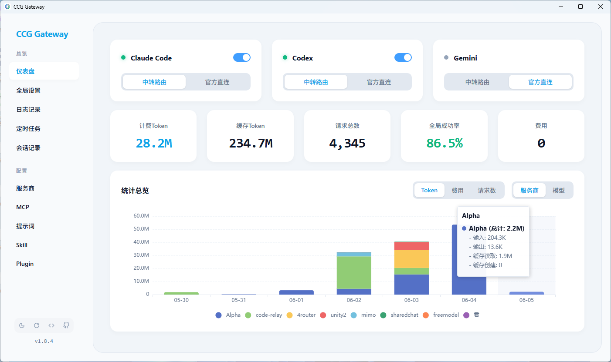
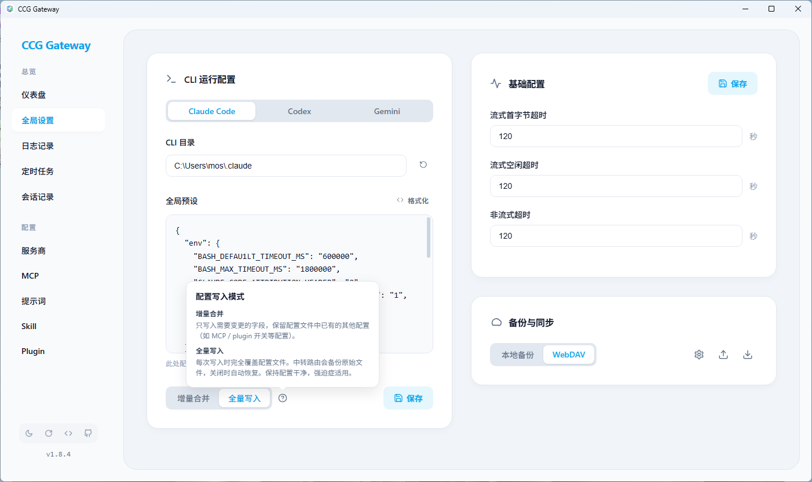
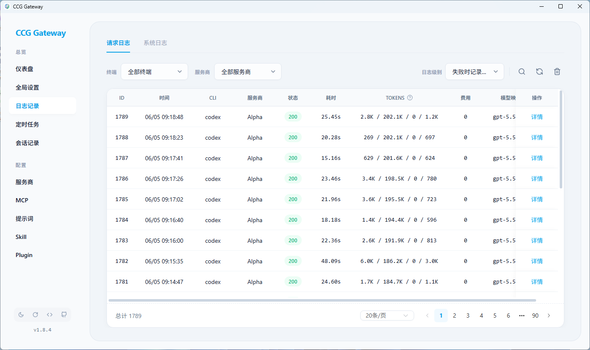
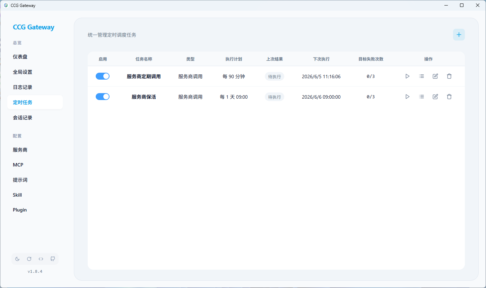
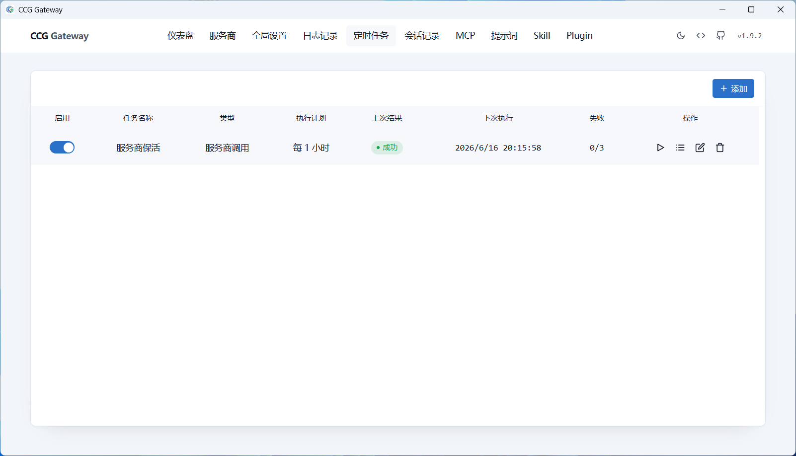
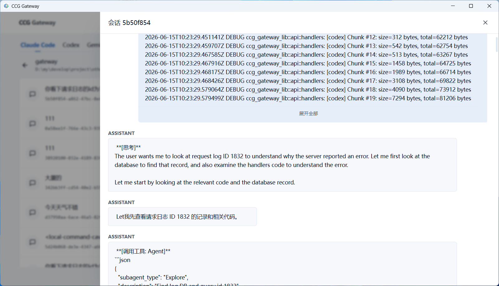
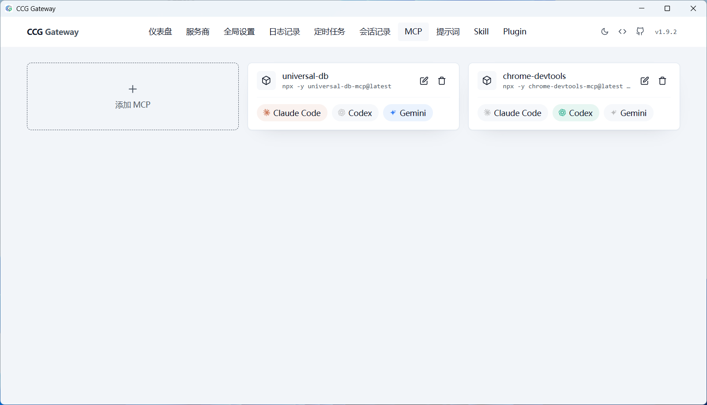
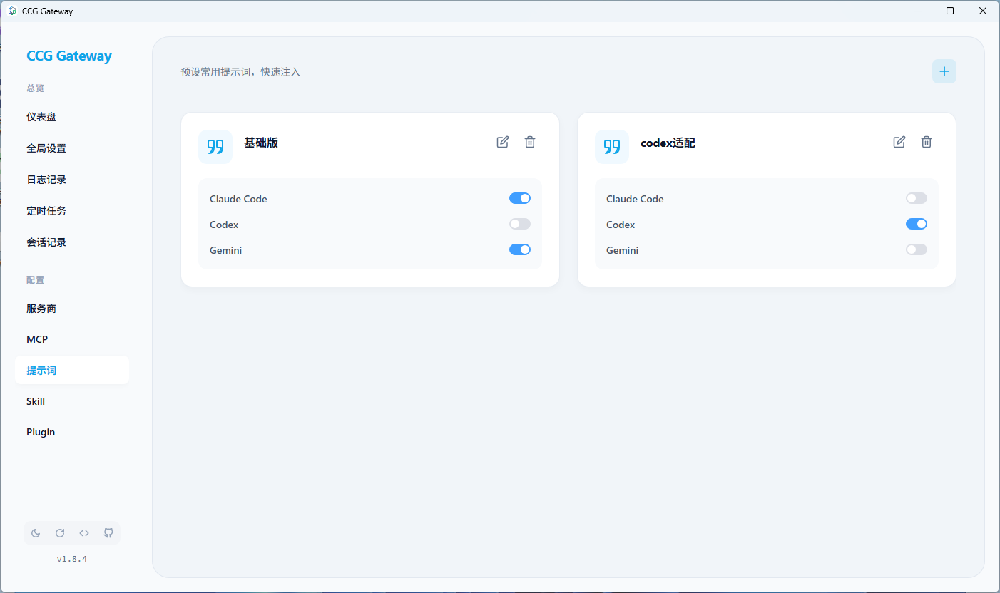
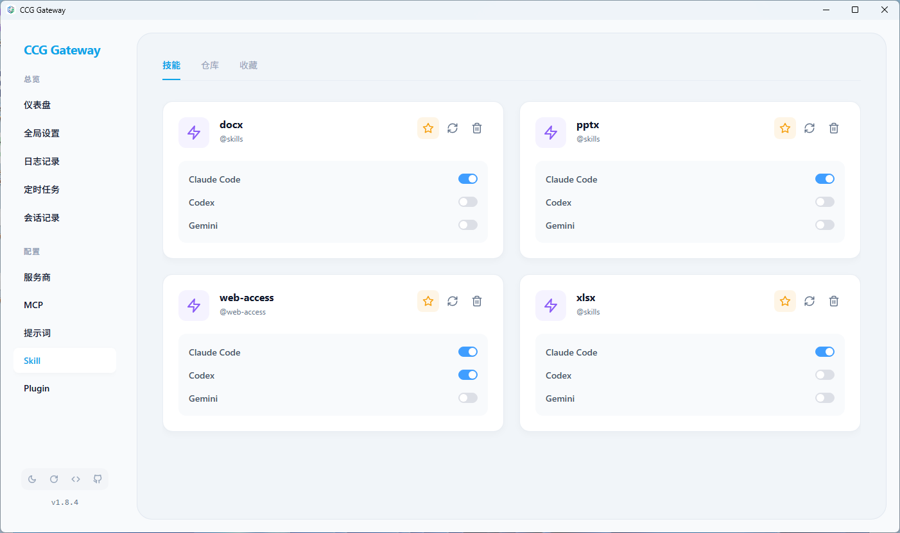
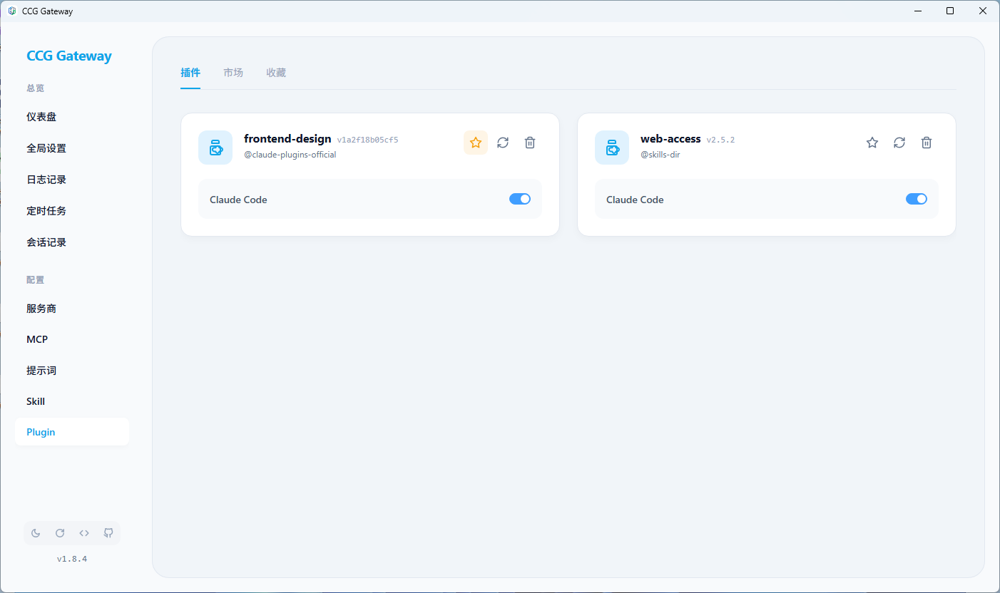

# CCG Gateway

[中文](README.md) | English

<div align="center">
<strong>Intelligent AI Model Gateway | Unified Proxy · Direct CLI Writes · Load Balancing · Failover</strong>

[](https://www.rust-lang.org/)
[](https://tauri.app/)
[](https://vuejs.org/)
[](https://www.typescriptlang.org/)
[](https://linux.do)
[](LICENSE)
</div>

## 📖 Introduction

CCG Gateway is a desktop management tool built for Claude Code, Codex, and Gemini CLI, integrating an intelligent gateway, account management, and configuration management.

This project was initiated based on the author's actual needs to solve various pain points encountered during usage. Several open-source projects were referenced during development, see [Acknowledgments](#-acknowledgments) for details.

---

## 🔥 Core Pain Points

**Unstable Service Providers**

Service providers may experience quota reset windows, rate limiting, or downtime? The gateway automatically switches to available providers and periodically re-checks — zero user perception.

More handy features: provider availability checks; model name mapping; automatic routing of missing models to available providers; custom request User-Agent.

**Provider Keep-Alive & Refresh Windows**

Scheduled tasks automatically make small calls to cover provider windows and improve N-hour quota usage efficiency.

**Multi-Project, Multi-Provider Parallel Workflow**

When developing multiple projects in parallel with the same Agent, Profiles let different projects use different providers.

**Cumbersome Relay / Direct Switching**

Need to switch between gateway relay routing, direct relay provider access, and official account direct access? Write the corresponding CLI config from the UI with one click, with no manual config-file edits.

**Hard to Estimate Costs**

The statistics dashboard covers provider/model token usage and cost statistics, making costs easy to calculate.

Providers that charge by request count? The statistics dashboard also covers provider / model dual-dimension request counts.

**Opaque Request Information**

Request logs record status, latency, token usage, cost, agent requests, provider responses, and more for every call — all at a glance.

**Hard to Trace Sessions**

Browse session history grouped by project, with access to the AI's thought process, tool calls, and return results.

**Repetitive Configuration Across Multiple Agents**

MCP, preset prompts, Skills, plugins, and other tools only need to be configured once to be quickly applied across multiple Agents.

**Cross-Device Configuration Sync**

Supports local export and WebDAV cloud backup for quick restoration of full configurations across devices.

---

## 📸 Interface Preview

<div align="center">
  
  
  
  
  
  
  
  
  
  
</div>

---

## 💡 Features

> Only unique features are listed here for quick reference!!!

### Statistics Overview

- Provides statistics across provider/model dimensions, covering token usage, request counts, and costs.
- Supports clearing historical statistics in Log Management.

### CLI Modes

- Relay Routing: Agent requests are written to the gateway address, and the gateway handles provider routing, load balancing, and failover.
- Relay Direct: Write a specified provider directly to the CLI config, so the Agent connects to that provider directly.
- Official Direct: Write official account credentials to the CLI config, so the Agent uses the official request path.

### Relay Providers

- Model Mapping: Automatically maps when the agent's model name differs from the provider's model name, with no need to manually edit config files.
  - Wildcards: `*` for any length of characters, `?` for a single character.
  - Example: `*opus* -> gml-5` maps any model with "opus" in its name to the provider's gml-5 model.
- Model Blacklist: Configure models a provider doesn't support; requests automatically skip that provider and route to one that supports the model.
- Failure Blacklist: Automatically blacklists a provider after N consecutive failures for M minutes, with periodic automatic recovery. The default failure threshold is 5.
- Pricing: Configure per-million-token prices for input, output, cache read, and cache creation. Statistics and logs use them to calculate costs automatically.
- Supports writing a provider to the CLI config with one click and displaying the current direct-access status.

### Official Accounts

- Supports credential configuration for multiple accounts, with one-click reading from the Agent.
- Supports drag-and-drop to quickly switch the currently active account credentials.
- Supports writing specified official credentials to the CLI config and displaying the current write status.
- Official accounts bypass gateway forwarding and use the Agent's own requests to avoid account risk controls.

### Scheduled Tasks

- Call providers during idle periods to trigger billing window updates and move the next reset time forward.
- Periodically call providers for keep-alive, preventing accounts from being removed by providers.

### Global CLI Settings

- CLI Runtime Configuration: Supports configuring Agent data directories, making it easy for WSL users to write files correctly.
- Global Presets: Written into each Agent's configuration file (e.g., `~/.claude/settings.json`). No need to configure BASE_URL or AUTH_TOKEN — the gateway writes them automatically.
- Incremental / Full Write: Incremental writing preserves configurations made by the Agent itself; full writing does not.
- After the config directory, default config, or write mode changes, the corresponding config is automatically rewritten according to the current CLI mode.

### Log Management

- Request Logs: Split into request metadata and request details.
  - Metadata: request time, agent, provider, status, latency, token breakdown, cost, model mapping, error messages, etc.
  - Request Details: agent request headers / body, gateway forwarded request headers / body, provider response headers / body.
- Log Levels: full logging, log details on failure only, or disable logging. Full logging records request details regardless of success; disabling logging records nothing.
- Request detail data is stored in files, allowing cleanup of large logs while retaining metadata.
- Supports clearing statistics for recalculating usage and request counts.

### MCP / Prompts / Skills / Plugin Management

- MCP: Configure once, enable/disable across multiple CLIs. Codex automatically converts to Toml format.
- Prompts: Configure once, enable/disable across multiple CLIs.
- Skills: supports installation from local directories or remote Git repositories, providing skill favorites and quick reinstallation.
- Plugins: supports installation from local directories or remote Git repositories, providing plugin favorites and quick reinstallation.

### Appearance & Experience

- Theme Switching: Supports one-click switching between global light/dark themes.
- Traditional Color Palette: Hand-picked color schemes for a comfortable visual experience.

---

## 🚀 Quick Start

### Method 1: Download from Releases (Multi-platform)

1. Go to the [Releases](https://github.com/mos1128/ccg-gateway/releases) page to download the latest version.
2. Select the corresponding file for your operating system.

### Method 2: Install with Scoop (Windows)

```powershell
scoop install extras/ccg-gateway
```

### Method 3: Run from Source

#### Requirements

- Rust 1.80+
- Node.js 18+
- pnpm 11+

#### Quick Start

**Method 3-1: One-click Start Script**

The script automatically starts the frontend development server and the Tauri backend. Requires `tauri-cli` to be installed.

```bash
# Start the development environment (Frontend + Backend)
./dev.bat
```

**Method 3-2: Manual Dependency Installation and Start**

Run directly via `cargo`. Does not support hot reloading; the backend must be restarted manually.

```bash
# Start the frontend development server
cd frontend
pnpm install
pnpm dev

# Open a new terminal, start Tauri backend
cd src-tauri
cargo run
```

---

## ⚙️ Configuration Guide

### Environment Variables

CCG Gateway is configured via environment variables. All configurations have default values and work out of the box.

| Environment Variable | Default Value | Description |
|---------|------|------|
| `CCG_GATEWAY_HOST` | `127.0.0.1` | Backend API server listening address |
| `CCG_GATEWAY_PORT` | `7788` | Backend API server port |
| `CCG_DATA_DIR` | `~/.ccg-gateway` | Directory for configuration and log files |
| `CCG_LOG_FILE` | `false` | Set to `true` or `1` to enable file logging |
| `CCG_LOG_LEVEL` | See description below | Log level configuration |

**CCG_LOG_LEVEL Description**

Supports module-level log configuration. Format: `global_level,module1=level,module2=level`

- Global: Controls the default log level for all modules.
- `ccg_gateway`: The main desktop application.
- `ccg_gateway_lib`: The core gateway library.

Default:

- Development builds: `info,ccg_gateway=debug,ccg_gateway_lib=debug` (Global info, core modules debug)
- Release builds: `info`

Example: `CCG_LOG_LEVEL=warn,ccg_gateway_lib=trace` means global warn, but ccg_gateway_lib outputs trace level logs.

`CCG_LOG_FILE=true` writes an additional file log. It does not disable console or systemd journal output. Set `CCG_LOG_LEVEL=warn` or a higher threshold to reduce journal output.

#### How to Set Environment Variables

**Windows (PowerShell)**
```powershell
# Temporary setting (valid for the current terminal session)
$env:CCG_GATEWAY_PORT="8080"
$env:CCG_DATA_DIR="D:\ccg-data"

# Permanent setting
[System.Environment]::SetEnvironmentVariable('CCG_GATEWAY_PORT', '8080', 'User')
```

**macOS / Linux (Bash/Zsh)**
```bash
# Temporary setting (valid for the current terminal session)
export CCG_GATEWAY_PORT=8080
export CCG_DATA_DIR="/opt/ccg-data"

# Permanent setting (add to ~/.bashrc or ~/.zshrc)
echo 'export CCG_GATEWAY_PORT=8080' >> ~/.bashrc
echo 'export CCG_DATA_DIR="/opt/ccg-data"' >> ~/.bashrc
source ~/.bashrc
```

---

## 🤝 Contributing

Issues and Pull Requests are welcome!

1. Fork this repository
2. Create a feature branch (`git checkout -b feature/AmazingFeature`)
3. Commit changes (`git commit -m 'Add some AmazingFeature'`)
4. Push to the branch (`git push origin feature/AmazingFeature`)
5. Open a Pull Request

---

## 🙏 Acknowledgments

Thanks to the contributors of the following open-source projects:

- [cc-switch](https://github.com/farion1231/cc-switch) - A cross-platform desktop All-in-One assistant tool for Claude Code, Codex & Gemini CLI.
- [coding-tool](https://github.com/CooperJiang/coding-tool) - claudecode|codex|gemini cli enhancement tool.
- [code-switch-R](https://github.com/Rogers-F/code-switch-R) - Claude Code & Codex multi-provider proxy & management tool.

---

<div align="center">
<strong>If this project is helpful to you, please give it a ⭐️ Star!</strong>
</div>
