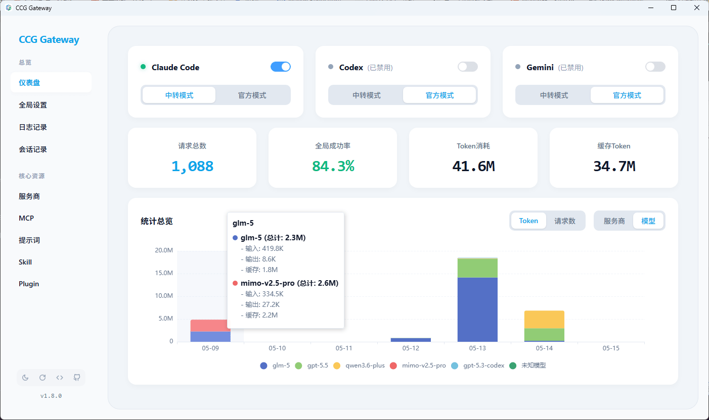
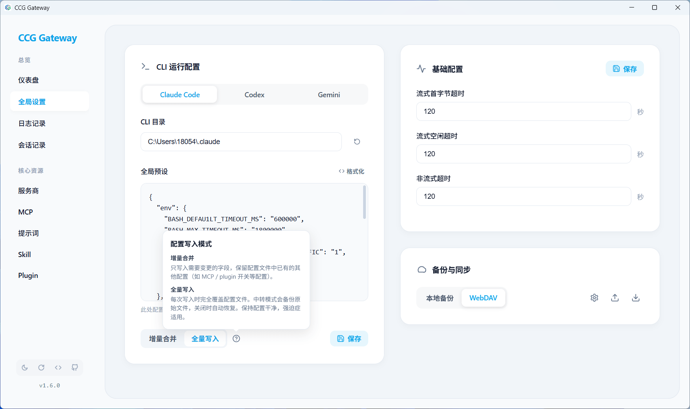
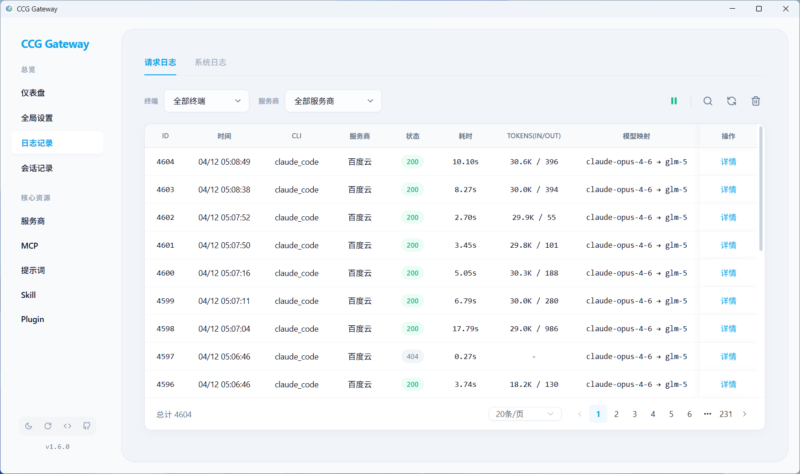
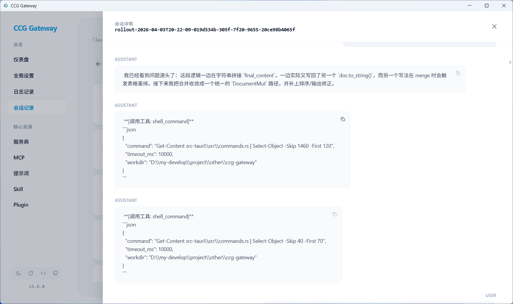
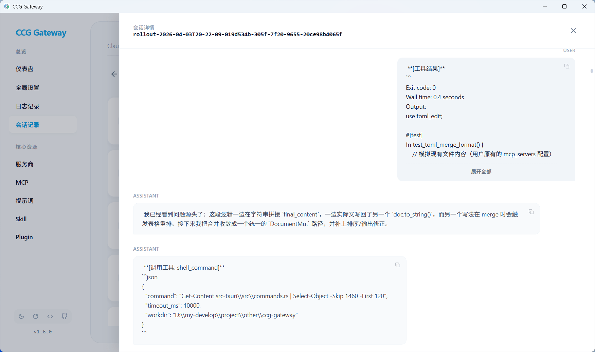
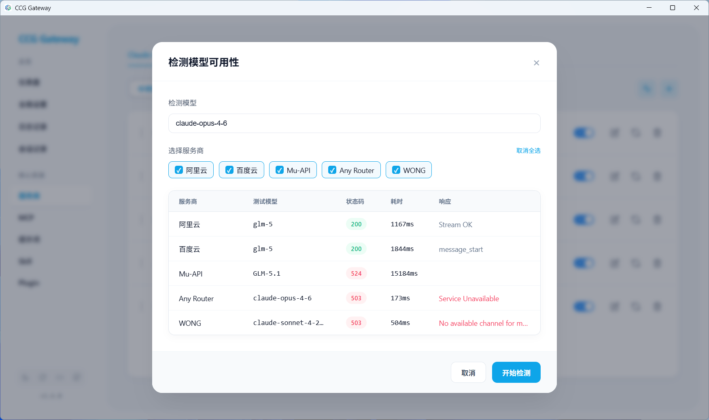
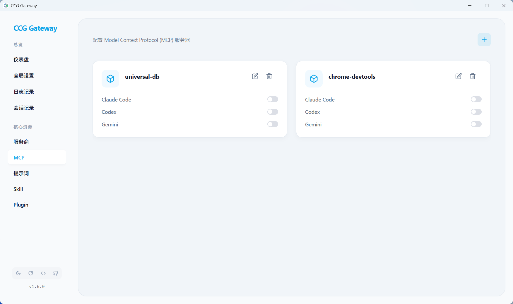
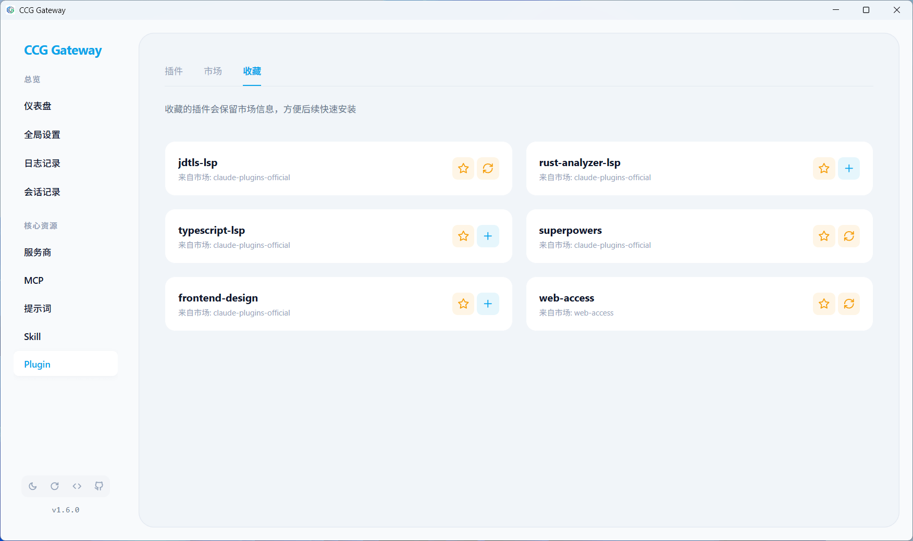

# CCG Gateway

[中文](README.md) | English

<div align="center">
<strong>Intelligent AI Model Gateway | Unified Proxy · Load Balancing · Failover</strong>

[](https://www.rust-lang.org/)
[](https://tauri.app/)
[](https://vuejs.org/)
[](https://www.typescriptlang.org/)
[](LICENSE)
</div>

## 📖 Introduction

CCG Gateway is a desktop management tool built for Claude Code, Codex, and Gemini CLI, integrating an intelligent gateway and configuration management.

This project was initiated based on the author's actual needs to solve various pain points encountered during usage. Several open-source projects were referenced during development, see [Acknowledgments](#-acknowledgments) for details.

### Problems Solved

**Unstable Service Providers**

Service providers may experience quota reset windows, rate limiting, or downtime. The gateway automatically switches to available providers and periodically re-checks, with zero user perception.

Even better: Concurrent testing of provider availability; model name mapping; skipping unsupported models.

**Tedious Multi-Account Switching**

Multiple official accounts or multiple relay providers? Quickly switch accounts / adjust priorities by dragging and dropping.

**Opaque Request Information**

Request logs record every model call. Status, latency, token usage, and request/response information are clear at a glance.

**Hard to Trace Sessions**

Browse session history grouped by project to view the AI's thought process, tool calls, and return results.

**Repetitive Configuration Across Multiple CLIs**

Configure tools like MCP, preset prompts, Skills, and plugins just once, and quickly apply them to multiple CLIs.

**Repetitive Configuration Across Devices**

Supports local export and WebDAV cloud backup for quick restoration of full configurations across devices.

---

## 📸 Interface Preview

<div align="center">
  
  
  
  
  
  
  
  
</div>


---

## 💡 Features

### Dashboard

- Statistics: Request count, success rate, token consumption.
- Provider success rate/usage statistics, request trend charts.

### Provider & Account Management

**Relay Providers**

- Supports multi-profile mode, each with independent provider configurations to meet isolation needs in different scenarios.
- Model Testing: Concurrently test specified models across multiple providers to intuitively view availability and response latency, following model mapping rules.
- Model Mapping: Automatically map when the provider's model name differs from the CLI's model name. Supports wildcards: `*` for any string length, `?` for a single character.
  - E.g., `*opus* -> gml-5` maps models with "opus" in the name to the provider's "gml-5" model.
- Model Blacklist: Configure models not supported by a provider to automatically skip that provider during requests.
- Failure Blacklist: Automatically blacklist a provider for M minutes after N consecutive failures, and automatically restore periodically.
- Custom UA: Replace the request's User-Agent.

**Official Accounts**

- Store multiple sets of credential configurations, supporting one-click reading from the current CLI.
- Drag and drop to quickly switch the currently used account credentials.
- Official accounts bypass gateway forwarding and use the CLI's own requests to avoid security risks.

### Log Management

- Request Logs: Record detailed information for each request: request content, response content, latency, status code, token usage, source model, and mapped model.

- System Logs: Record system events such as provider switching, failures, and blacklisting.

### Session Management

Browse session history of each CLI grouped by project, viewing message lists, AI thought processes, tool calls, and return results. Supports project search and session search.

### MCP / Prompts / Skills / Plugin Management

- **MCP**: Configure once, enable/disable for multiple CLIs.
- **Preset Prompts**: Configure once, enable/disable for multiple CLIs.
- **Skills**: Visual management, supports installation from local directories or remote Git repositories, providing skill favorites and quick reinstallation.
- **Plugins**: Visual management, supports installation from local directories or remote Git repositories, providing plugin favorites and quick reinstallation.

### Backup & Restore

- **Local Backup**: Export database files locally, or restore from local files.
- **WebDAV Cloud Backup**: Configure a WebDAV server to upload backups, view history lists, and select restore or delete.

### Appearance & Experience

- **Theme Switching**: Supports one-click switching of global light/dark themes.
- **Traditional Color Palette**: Manually selected color schemes provide a comfortable visual experience.

---

## 🚀 Quick Start

### Method 1: Download from Releases (Recommended)

1. Go to the [Releases](https://github.com/mos1128/ccg-gateway/releases) page to download the latest version.
2. Select the corresponding file for your operating system.

### Method 2: Run from Source

#### Requirements

- Rust 1.80+
- Node.js 18+
- pnpm

#### Quick Start

**Method 2-1: One-click Start Script (Recommended)**

The script automatically starts the frontend development server and the Tauri backend. Requires `tauri-cli` installed and supports hot reloading.

```bash
# Start the development environment (Frontend + Backend)
dev.bat
```

**Method 2-2: Manual Dependency Installation and Start**

Run directly via `cargo`. Does not support hot reloading, requiring manual restart of the backend.

```bash
# Install frontend dependencies
cd frontend
pnpm install

# Start frontend development server
pnpm dev

# Open a new terminal, start Tauri backend
cd src-tauri
cargo run
```

---

## ⚙️ Configuration Guide

### Environment Variables

CCG Gateway is configured via environment variables. All configurations have default values and work out of the box.

| Environment Variable | Default Value | Description |
|---------|------|------|
| `CCG_GATEWAY_HOST` | `127.0.0.1` | Backend API server listening address |
| `CCG_GATEWAY_PORT` | `7788` | Backend API server port |
| `CCG_DATA_DIR` | `~/.ccg-gateway` | Directory for configuration and log files |
| `CCG_LOG_FILE` | `false` | Set to `true` or `1` to enable file logging |
| `CCG_LOG_LEVEL` | See description below | Log level configuration |

**CCG_LOG_LEVEL Description**

Supports module-level log configuration. Format: `global_level,module1=level,module2=level`

- Global: Controls the default log level for all modules.
- `ccg_gateway`: The main desktop application.
- `ccg_gateway_lib`: The core gateway library.

Default: `info,ccg_gateway=debug,ccg_gateway_lib=debug` (Global info, core modules debug)

Example: `CCG_LOG_LEVEL=warn,ccg_gateway_lib=trace` means global warn, but ccg_gateway_lib outputs trace level logs.

#### How to Set Environment Variables

**Windows (PowerShell)**
```powershell
# Temporary setting (valid for the current terminal session)
$env:CCG_GATEWAY_PORT="8080"
$env:CCG_DATA_DIR="D:\ccg-data"

# Permanent setting
[System.Environment]::SetEnvironmentVariable('CCG_GATEWAY_PORT', '8080', 'User')
```

**macOS / Linux (Bash/Zsh)**
```bash
# Temporary setting (valid for the current terminal session)
export CCG_GATEWAY_PORT=8080
export CCG_DATA_DIR="/opt/ccg-data"

# Permanent setting (add to ~/.bashrc or ~/.zshrc)
echo 'export CCG_GATEWAY_PORT=8080' >> ~/.bashrc
echo 'export CCG_DATA_DIR="/opt/ccg-data"' >> ~/.bashrc
source ~/.bashrc
```

---

## 🤝 Contributing

Issues and Pull Requests are welcome!

1. Fork this repository
2. Create a feature branch (`git checkout -b feature/AmazingFeature`)
3. Commit changes (`git commit -m 'Add some AmazingFeature'`)
4. Push to the branch (`git push origin feature/AmazingFeature`)
5. Open a Pull Request

---

## 🙏 Acknowledgments

Thanks to the contributors of the following open-source projects:

- [cc-switch](https://github.com/farion1231/cc-switch) - A cross-platform desktop All-in-One assistant tool for Claude Code, Codex & Gemini CLI.
- [coding-tool](https://github.com/CooperJiang/coding-tool) - claudecode|codex|gemini cli enhancement tool.
- [code-switch-R](https://github.com/Rogers-F/code-switch-R) - Claude Code & Codex multi-provider proxy & management tool.
- [LinuxDo](https://linux.do) - A passionate and friendly non-Linux community.

---

<div align="center">
<strong>If this project is helpful to you, please give it a ⭐️ Star!</strong>
</div>