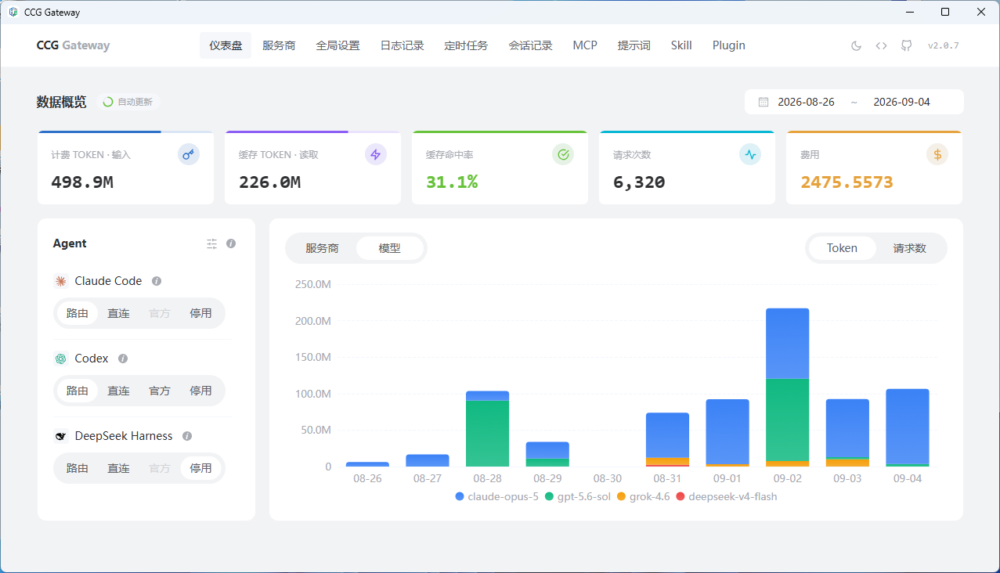
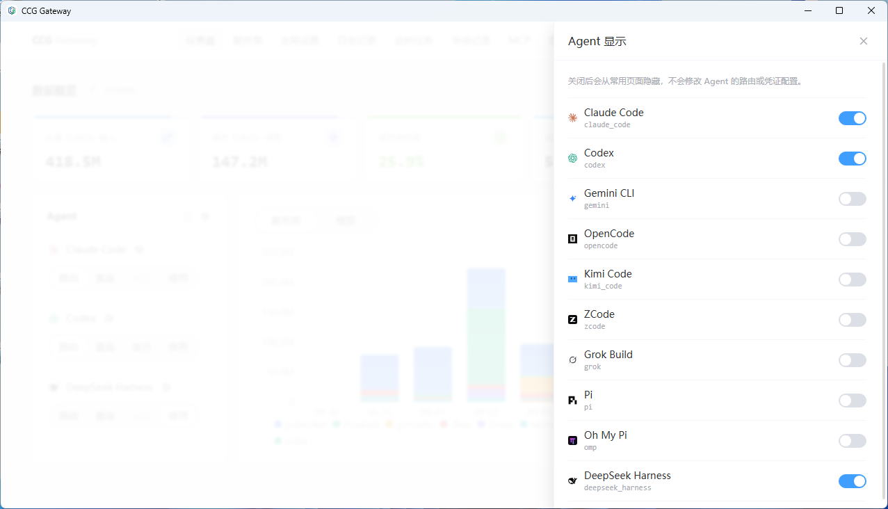
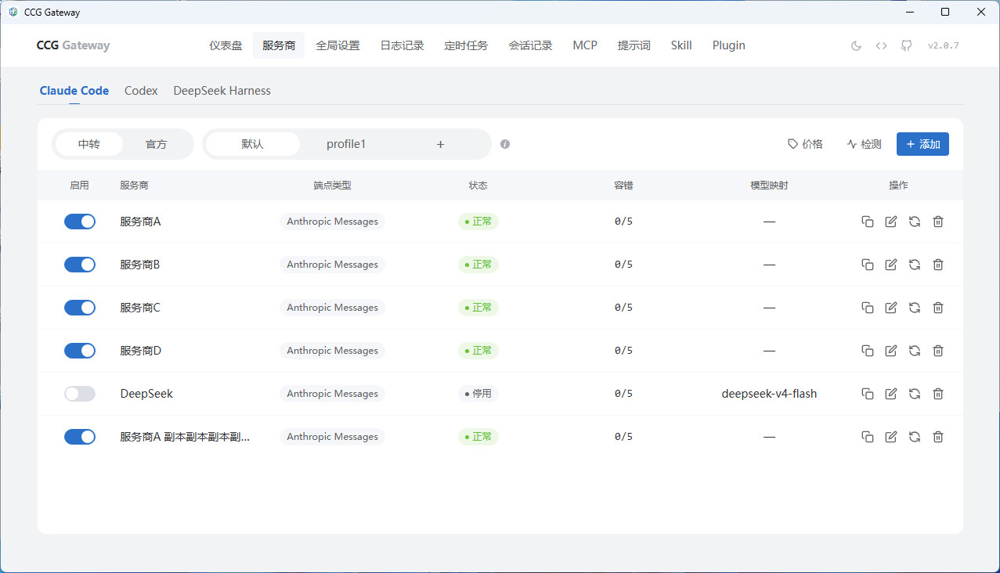
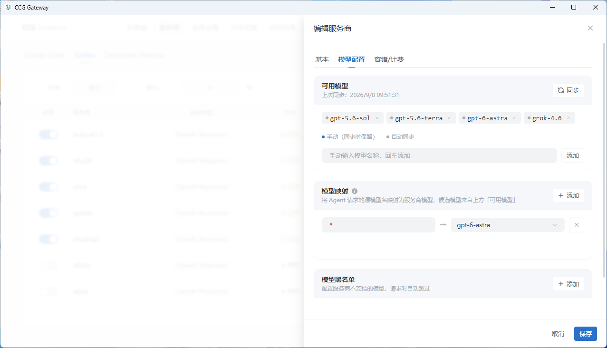
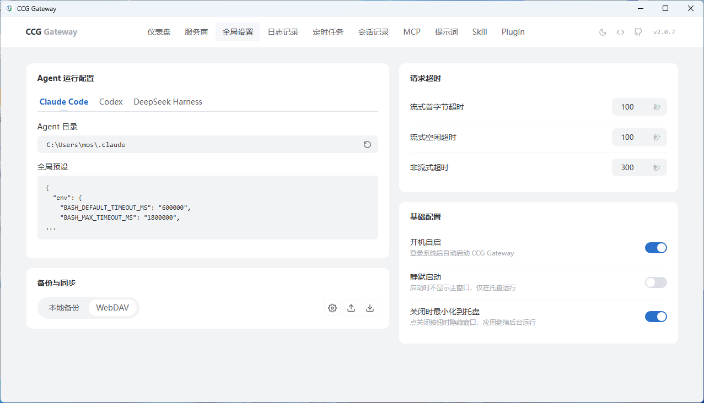
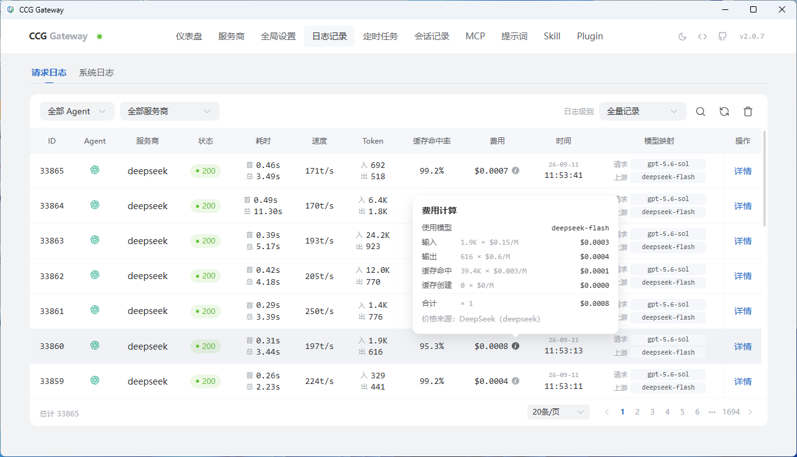
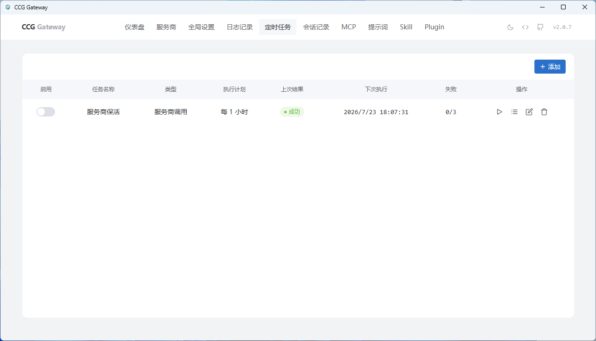
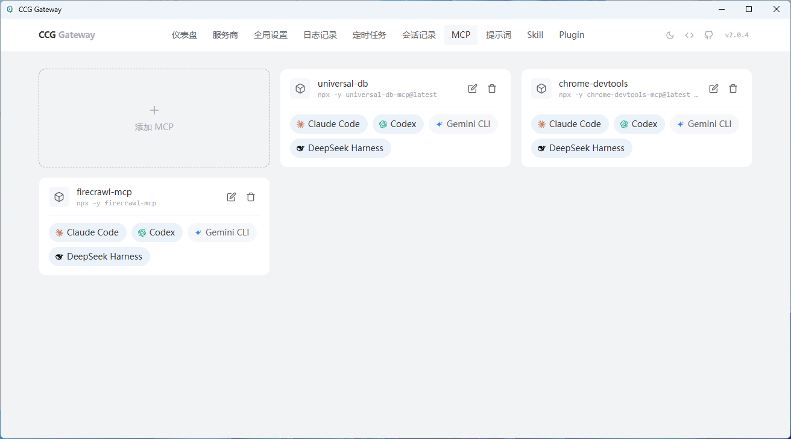
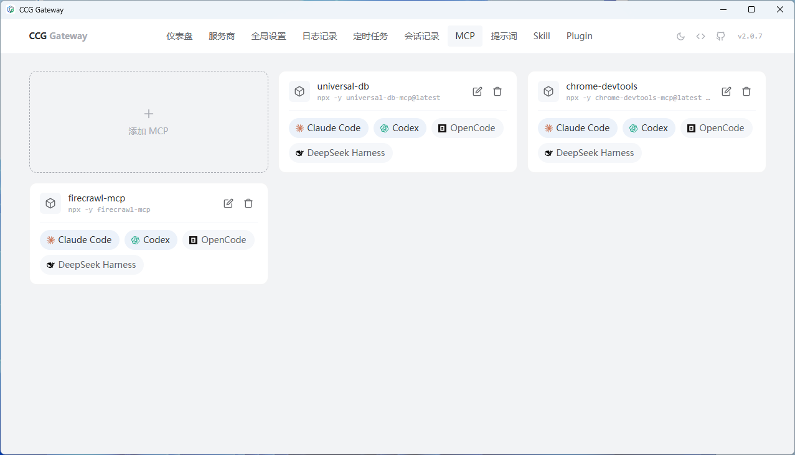
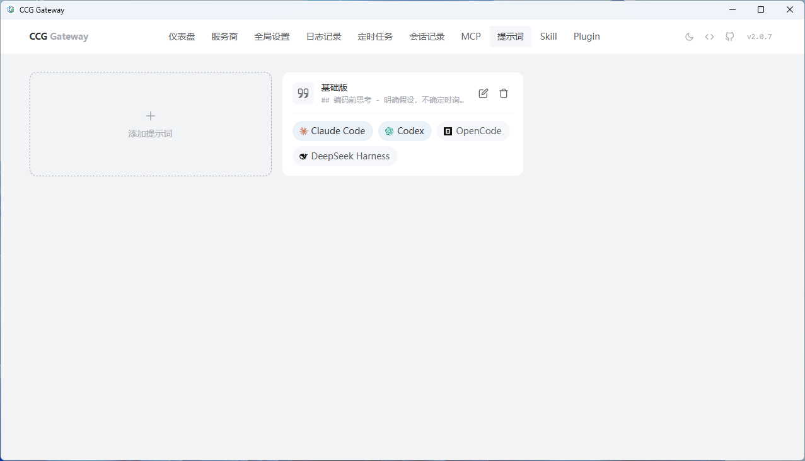

# CCG Gateway

[中文](README.md) | English

<div align="center">
<strong>Intelligent AI Model Gateway | Unified Proxy · Direct CLI Writes · Smart Failover · Accurate Billing</strong>

[](https://www.rust-lang.org/)
[](https://tauri.app/)
[](https://vuejs.org/)
[](https://www.typescriptlang.org/)
[](LICENSE)

</div>

## 📖 Introduction

CCG Gateway is a desktop management tool for Agents including Claude Code, Codex, Gemini CLI, OpenCode, Kimi Code, ZCode, Grok Build, Pi, Oh My Pi, and DeepSeek Harness, integrating an intelligent gateway, account management, and configuration management.

This project was initiated based on the author's actual needs to solve various pain points encountered during usage. Several open-source projects were referenced during development, see [Acknowledgments](#-acknowledgments) for details.

---

## ✨ Highlights

- 🧩 **Multi-Agent Management** - 10+ built-in Agent templates, plus custom templates for onboarding new Agents
- 🔌 **Multi-Protocol Routing** - Supports four endpoint types: Anthropic Messages / OpenAI Chat / OpenAI Responses / Gemini generateContent
- 🔄 **Protocol Translation** - Anthropic Messages / OpenAI Chat / OpenAI Responses convert to one another, so an Agent can use providers that speak a different protocol
- 🔀 **Failover** - On upstream failure, automatic retries, provider switching, breaker cooldown, and periodic re-checks — invisible to the user
- 🛡️ **Stream Inspection** - A stream reaches the client only after its first chunk passes inspection; on an upstream error the provider is switched silently without interrupting the Agent's task
- 🔁 **Model Mapping** - Wildcard rewriting when Agent and provider model names differ, with no manual config edits
- 🚫 **Model Blacklist** - Models a provider doesn't support are skipped automatically and routed to a provider that does
- 💰 **Price Sync** - Official model prices are synced automatically (including long-context tiered pricing); each provider only needs a single multiplier
- 📋 **Model List Sync** - Quickly fetch a provider's available models and pick mapping targets straight from a dropdown
- 🧪 **Availability Detection** - Batch-check model availability and latency across multiple providers
- ⏰ **Scheduled Tasks** - Small calls during idle hours to move quota resets earlier; keeps accounts alive
- 📊 **Full-Dimension Statistics** - Token usage, cost, request counts, and cache hit rate across provider / model dimensions
- 🔍 **Request Logs** - Status, first-byte / total latency, token breakdown, cache hit rate, cost derivation, raw request and response for every call
- 💬 **Traceable Sessions** - Browse session history grouped by project, including thought process, tool calls, and results
- 🗂️ **Multi-Profile** - Run the same Agent on parallel projects, with different providers per project
- 🧰 **Shared Tool Config** - Configure MCP, prompts, Skills, and Plugins once, then apply them across multiple Agents
- ☁️ **Cross-Device Sync** - Local export/import and WebDAV cloud backup for quick full-configuration restore across devices

---

## 📸 Interface Preview

<div align="center">
  
  
  
  
  
  
  
  
  
  
</div>

---

## 💡 Features

> Only some feature points are explained here, for a quick start!!!

### Dashboard

- Two-dimension charts: legend entries are selectable, and the KPI cards update along with the selection.
- Filter by date range or quick presets.
- Statistics auto-refresh on a timer and can be paused at any time.

### Agent Templates

- User templates can add new Agents or override built-in templates by using the same `id`.
- User templates are stored in `~/.ccg-gateway/agent-definitions/{id}.json` by default and require an application restart after changes. See the [Agent Template Development Guide](agent-template-guide.md) for field definitions, allowed values, and complete examples.

### Relay Providers

- Endpoint Type: declare each provider as Anthropic / OpenAI Chat / OpenAI Responses / Gemini; the gateway matches it against the Agent's actual request path.
- Protocol Translation: when the endpoint type differs from the Agent's request protocol, the request and response (including streaming) are converted automatically — for example, Claude Code can use an OpenAI Chat provider directly. Anthropic Messages / OpenAI Chat / OpenAI Responses convert to one another; Gemini stays pass-through only. Providers marked with the translation icon in the list are the ones being converted.
- Model Mapping: Automatically maps when the agent's model name differs from the provider's model name, with no need to manually edit config files.
  - Wildcards: `*` for any length of characters, `?` for a single character.
  - Example: `*opus* -> gml-5` maps any model with "opus" in its name to the provider's gml-5 model.
  - Mapping targets can be selected from the provider's available models via dropdown, or typed manually.
- Failover Rules: On failure, the request first retries on the current provider (configurable consecutive retry count, default 3), then switches to the next provider; once every provider has had a turn, the rotation starts over until one succeeds or all of them trip the breaker. When consecutive failures reach the threshold (default 5), the provider enters a breaker cooldown (default 10 minutes) and other providers take over in the meantime. Problems with the request itself, such as invalid credentials or a nonexistent model, switch providers immediately instead of wasting retries.

### Multi-Profile

- Create multiple Profiles under the same Agent, each maintaining its own provider list; double-click a tab to rename it.
- Every Profile generates a matching launch command that can be copied with one click (e.g. `claude --settings ~/.claude/settings-ccg-work.json`).
- Agents started with their respective launch commands don't interfere with each other.

### Official Accounts

- Supports credential configuration for multiple accounts, with one-click import of already logged-in credentials.
- Supports drag-and-drop to quickly switch the currently active account credentials.
- Official accounts are not forwarded through the gateway, avoiding account risk controls.

### Global Settings

- Global Presets: Written into each Agent's configuration file (e.g., `~/.claude/settings.json`). No need to configure BASE_URL or AUTH_TOKEN — the gateway writes them automatically.
- Incremental / Full Write: Incremental writing preserves configurations written by the Agent itself; full writing does not.

### Log Management

- Request Logs: Split into request metadata and request details.
  - Metadata: request time, agent, provider, status, first-byte/total latency, token breakdown, cache hit rate, cost, model mapping, error messages, etc.
  - Request Details: agent request headers / body, gateway forwarded request headers / body, provider response headers / body.
  - Cost Details: every cost shows its line-by-line calculation (tokens × unit price × multiplier) and the price source; errors are categorized as gateway-caught or upstream.
- System Logs: diagnostic events such as unmatched User-Agent, Agent/protocol config conflicts, and no available provider, with duplicate events collapsed.
- Log Levels: full logging, log details on failure only, or disable logging. Full logging records request details regardless of success; disabling logging records nothing.
- Request detail data is stored in files, allowing cleanup of large logs while retaining metadata.
- Cleanup Scopes: all logs / all details / statistics / logs older than 30 days / details older than 30 days; clearing statistics restarts usage and request counting.

### MCP / Prompts / Skills / Plugin Management

- MCP: Configure once, enable/disable across multiple Agents; special Agents get the format converted automatically.
- Prompts: Configure once, enable/disable across multiple Agents.
- Skills: add a remote Git repository or local directory as a skill repo, browse and install skills from it, with favorites, reinstall, uninstall, and a stale marker.
- Plugins: add a plugin marketplace (remote Git repository or local directory), then install, update, uninstall, and favorite plugins.

### Appearance & Experience

- Theme Switching: Supports one-click switching between global light / dark themes.
- The window size is remembered automatically and restored on the next launch.
- Built-in update check: checks GitHub Releases for new versions.

---

## 🚀 Quick Start

### Method 1: Download from Releases (Multi-platform)

1. Go to the [Releases](https://github.com/mos1128/ccg-gateway/releases) page to download the latest version.
2. Pick the file for your OS: `.exe` on Windows, `.dmg` (Universal) on macOS, `.AppImage` on Linux.

### Method 2: Install with Scoop (Windows)

```powershell
scoop install extras/ccg-gateway
```

### Method 3: Run from Source

#### Requirements

- Rust 1.80+
- Node.js 18+
- pnpm 11+

#### Quick Start

**Method 3-1: One-click Start Script**

```bash
# Start the development environment (Frontend + Backend), requires tauri-cli
./dev.bat
```

**Method 3-2: Manual Dependency Installation and Start**

```bash
# Start the frontend development server
cd frontend
pnpm install
pnpm dev

# Open a new terminal, start Tauri backend
cd src-tauri
cargo run
```

---

## ⚙️ Configuration Guide

### Environment Variables

CCG Gateway is configured via environment variables. All configurations have default values and work out of the box.

| Environment Variable | Default Value         | Description                                             |
| -------------------- | --------------------- | ------------------------------------------------------- |
| `CCG_GATEWAY_HOST`   | `127.0.0.1`           | Backend API server listening address                    |
| `CCG_GATEWAY_PORT`   | `7788`                | Backend API server port                                 |
| `CCG_DATA_DIR`       | `~/.ccg-gateway`      | Directory for databases, logs, and user Agent templates |
| `CCG_LOG_FILE`       | `false`               | Set to `true` or `1` to enable file logging             |
| `CCG_LOG_LEVEL`      | See description below | Log level configuration                                 |

**CCG_LOG_LEVEL Description**

Supports module-level log configuration. Format: `global_level,module1=level,module2=level`

- Global: Controls the default log level for all modules.
- `ccg_gateway`: The main desktop application.
- `ccg_gateway_lib`: The core gateway library.

Default:

- Development builds: `info,ccg_gateway=debug,ccg_gateway_lib=debug` (Global info, core modules debug)
- Release builds: `info`

Example: `CCG_LOG_LEVEL=warn,ccg_gateway_lib=trace` means global warn, but ccg_gateway_lib outputs trace level logs.

`CCG_LOG_FILE=true` writes an additional file log. It does not disable console or systemd journal output. Set `CCG_LOG_LEVEL=warn` or a higher threshold to reduce journal output.

#### How to Set Environment Variables

**Windows (PowerShell)**

```powershell
# Temporary setting (valid for the current terminal session)
$env:CCG_GATEWAY_PORT="8080"
$env:CCG_DATA_DIR="D:\ccg-data"

# Permanent setting
[System.Environment]::SetEnvironmentVariable('CCG_GATEWAY_PORT', '8080', 'User')
```

**macOS / Linux (Bash/Zsh)**

```bash
# Temporary setting (valid for the current terminal session)
export CCG_GATEWAY_PORT=8080
export CCG_DATA_DIR="/opt/ccg-data"

# Permanent setting (add to ~/.bashrc or ~/.zshrc)
echo 'export CCG_GATEWAY_PORT=8080' >> ~/.bashrc
echo 'export CCG_DATA_DIR="/opt/ccg-data"' >> ~/.bashrc
source ~/.bashrc
```

---

## 🤝 Contributing

Issues and Pull Requests are welcome!

1. Fork this repository
2. Create a feature branch (`git checkout -b feature/AmazingFeature`)
3. Commit changes (`git commit -m 'Add some AmazingFeature'`)
4. Push to the branch (`git push origin feature/AmazingFeature`)
5. Open a Pull Request

---

## 🙏 Acknowledgments

Thanks to the contributors of the following open-source projects:

- [cc-switch](https://github.com/farion1231/cc-switch) - A cross-platform desktop All-in-One assistant tool for Claude Code, Codex & Gemini CLI.
- [coding-tool](https://github.com/CooperJiang/coding-tool) - claudecode|codex|gemini cli enhancement tool.
- [code-switch-R](https://github.com/Rogers-F/code-switch-R) - Claude Code & Codex multi-provider proxy & management tool.
- [linux.do](https://linux.do/) - A friendly non-Linux community.

---

<div align="center">
<strong>If this project is helpful to you, please give it a ⭐️ Star!</strong>
</div>

